### 数位相关的贪心

- [G - Maximum Product](https://codeforces.com/gym/100886/problem/G) 
- 

### 入门题

- [855E - Salazar Slytherin's Locket](https://codeforces.com/problemset/problem/855/E) $查询b进制下[l,r]每个数码出现偶数次的个数,多测.记忆化数组复用$

- [1036C - Classy Numbers](https://codeforces.com/problemset/problem/1036/C) $查询十进制下[l,r]非0数码出现不超过3次的个数,多测.记忆化数组复用$

- [不要62](https://vjudge.net/problem/HDU-2089) `非常推荐。熟悉记忆化搜索的填数过程。` `查询[l,r]区间不包含4和62的数字个数`

- [好数](https://www.lanqiao.cn/problems/19709/learning) `非常推荐。熟悉记忆化搜索的填数过程。` `查询[1,N]从低位开始，奇数位填奇数，偶数位填偶数的个数`

- P13085 [SCOI2009] windy 数（加强版） $查询[l,r]之间相邻位之差至少为2的个数. 1 \le l,r \le 10^{18}$

- [Counting Numbers](https://cses.fi/problemset/task/2220) `查询[l,r]区间中相邻位不同的数字个数` $0 \le l,r \le 10^{18}$

- [Digit Sum](https://atcoder.jp/contests/dp/tasks/dp_s) `求[1,N]中数位和被D整除的数字个数` $1 \le D \le 100,1 \le N \le 10^{10000}$

- [E - Almost Everywhere Zero](https://atcoder.jp/contests/abc154/tasks/abc154_e) `求[l,N]中非0数位的个数恰好为k` $1 \le k \le 3,1 \le N \le 10^{100}$

- [369 Numbers](https://www.spoj.com/problems/NUMTSN/) `查询[l,r]范围内3,6,9至少出现1次且出现次数相等个数.` $1 \le l,r \le 10^{50}$

- [Little Elephant and Interval](https://codeforces.com/problemset/problem/204/A) `查询[l,r]区间数字首位和末尾相同个数` $1 \le l,r \le 10^{18}$

  递归展开图如下:

```mermaid
graph TD
    A["dfs(3,0,0,1,1)<br/>i=3,j=0,k=0,lim=1,zero=1<br/>返回:28"] --> B["zero=1: dfs(2,0,0,0,1)<br/>返回:18"]
    A --> C["d=1: dfs(2,1,1,0,0)<br/>返回:10"]
    A --> D["d=2: dfs(2,2,2,1,0)<br/>返回:0"]
    
    B --> E["zero=1: dfs(1,0,0,0,1)<br/>返回:9"]
    B --> F["d=1: dfs(1,1,1,0,0)<br/>返回:1"]
    B --> G["d=2: dfs(1,2,2,0,0)<br/>返回:1"]
    B --> H["d=3-9: 各返回1<br/>总计:7"]
    
    C --> I["d=0: dfs(1,0,1,0,0)<br/>返回:1"]
    C --> J["d=1: dfs(1,1,1,0,0)<br/>返回:1"]
    C --> K["d=2: dfs(1,2,1,0,0)<br/>返回:1"]
    C --> L["d=3-9: 各返回1<br/>总计:7"]
    
    D --> M["d=0: dfs(1,0,2,1,0)<br/>返回:0"]
    
    E --> N["zero=1: dfs(0,0,0,0,1)<br/>返回:0"]
    E --> O["d=1: dfs(0,1,1,0,0)<br/>返回:1"]
    E --> P["d=2: dfs(0,2,2,0,0)<br/>返回:1"]
    E --> Q["d=3-9: 各返回1<br/>总计:7"]
    
    F --> R["d=0: dfs(0,0,1,0,0)<br/>返回:0"]
    F --> S["d=1: dfs(0,1,1,0,0)<br/>返回:1"]
    F --> T["d=2-9: 各返回0<br/>总计:0"]
    
    G --> U["d=0: dfs(0,0,2,0,0)<br/>返回:0"]
    G --> V["d=1: dfs(0,1,2,0,0)<br/>返回:0"]
    G --> W["d=2: dfs(0,2,2,0,0)<br/>返回:1"]
    G --> X["d=3-9: 各返回0<br/>总计:0"]
    
    I --> Y["d=0: dfs(0,0,1,0,0)<br/>返回:0"]
    I --> Z["d=1: dfs(0,1,1,0,0)<br/>返回:1"]
    I --> AA["d=2-9: 各返回0<br/>总计:0"]
    
    J --> AB["d=0: dfs(0,0,1,0,0)<br/>返回:0"]
    J --> AC["d=1: dfs(0,1,1,0,0)<br/>返回:1"]
    J --> AD["d=2-9: 各返回0<br/>总计:0"]
    
    K --> AE["d=0: dfs(0,0,1,0,0)<br/>返回:0"]
    K --> AF["d=1: dfs(0,1,1,0,0)<br/>返回:0"]
    K --> AG["d=2: dfs(0,2,1,0,0)<br/>返回:0"]
    K --> AH["d=3-9: 各返回0<br/>总计:0"]
    
    M --> AI["d=0: dfs(0,0,2,1,0)<br/>返回:0"]
    
    %% 叶子节点返回值
    N --> AJ["返回:0<br/>(zero=1)"]
    O --> AK["返回:1<br/>(!zero && 1==1)"]
    P --> AL["返回:1<br/>(!zero && 2==2)"]
    R --> AM["返回:0<br/>(0≠1)"]
    S --> AN["返回:1<br/>(1==1)"]
    U --> AO["返回:0<br/>(0≠2)"]
    V --> AP["返回:0<br/>(1≠2)"]
    W --> AQ["返回:1<br/>(2==2)"]
    Y --> AR["返回:0<br/>(0≠1)"]
    Z --> AS["返回:1<br/>(1==1)"]
    AC --> AT["返回:1<br/>(1==1)"]
    AI --> AU["返回:0<br/>(0≠2)"]
    
    %% 缓存节点（绿色标记）
    style J fill:#90EE90
    style F fill:#90EE90
    style G fill:#90EE90
    style S fill:#90EE90
    style AC fill:#90EE90
    
    %% 缓存连接
    J -.->|"缓存命中:1"| AT
    F -.->|"缓存命中:1"| AN
    G -.->|"缓存命中:1"| AQ
    S -.->|"缓存命中:1"| AN
    AC -.->|"缓存命中:1"| AT

    %% 样式定义
    classDef cache fill:#90EE90;
    class J,F,G,S,AC cache;
```

- [Noora Number](https://toph.co/p/noora-number) `非常推荐。考察复用。T组测试样例。查询[1,N]区间出现的不同整数个数=最大数位的个数` $1 \le T  \le 10^5,1 \le N \le 10^{18}$
- [ Classy Numbers](https://codeforces.com/contest/1036/problem/C) `非常推荐。考察复用。T组测试样例。查询[l,r]区间出现非0个数不多于3个的个数.` $1 \le T  \le 10^5,1 \le l,r \le 10^{18}$
- 

### 习题练习

- [小苯的数字成鸡(A组)](https://ac.nowcoder.com/acm/contest/99909/H) $注意有小坑点，需要分类讨论或者巧妙设计$
- 

### 数位DP好题

- [ Magic Numbers](https://codeforces.com/contest/628/problem/D) `查询[l,r]区间中从高位开始奇数位不是d,偶数位是d,且被m整除的个数` $1 \le m \le 2000, 1 \le l,r \le 10^{2000},且l和r位数相同$  `如果l和r位数不同该如何做?`
- [Ra-One Numbers](https://www.spoj.com/problems/RAONE/)``查询[l,r]区间中低位到高位偶数减去奇数位和为1个数` $0 \le l,r \le 10^{8}$
- [LUCIFER Number](https://www.spoj.com/problems/LUCIFER/) ``查询[l,r]区间中低位到高位偶数减去奇数位和为质数个数` $0 \le l,r \le 10^{9}$
- [Chef and special numbers](https://www.codechef.com/problems/WORKCHEF)  `查询[l,r]区间被出现的数字整除个数至少为k的个数.` $1 \le l,r \le 10^{18}$
- [The Great Ninja War](https://www.hackerearth.com/problem/algorithm/sallu-bhai-and-ias-8838ac8d/) `查询[l,r]区间数位和D^D被出现的数字整除个数的个数.` $1 \le l,r \le 10^{12}$
- [D - Beautiful numbers](https://codeforces.com/contest/55/problem/D) $非常推荐.查询[l,r]区间被非零数码整除的个数.需要对空间进行优化$  :red_circle: 
- [特别数的和](https://www.lanqiao.cn/problems/191/learning) ``非常推荐。查询[1,N]区间中含有2,0,1,9的`**和**  $数据量很小， 1 \le N \le 10^4$
- [Digit Sum Divisible](https://atcoder.jp/contests/abc336/tasks/abc336_e) `非常推荐。计算区间[1,N]被数位和整除的个数` $1 \le N \le 10^{14}$ :red_circle:
- [[USACO14OPEN\] Odometer S](https://www.luogu.com.cn/problem/P3107) `非常推荐.计算区间[l,r]有一个数位至少出现一半的个数` $1 \le l,r \le 10^{18}$ :red_circle:
- [LIDS](https://toph.co/p/lids) `非常推荐.T组测试，求[l,r]区间内的最长递增数位长度及其个数.`   $1 \le l,r \le 10^{9}$
- [P4127  同类分布](https://www.luogu.com.cn/problem/P4127) $求[l,r]范围内能被数位和整除的个数$ :red_circle
- [SAC#1 - 萌数](https://www.luogu.com.cn/problem/P3413): $求包含长度至少为2的回文串的个数$
- [[BalticOI 2013\] Palindrome-Free Numbers (Day1)](https://www.luogu.com.cn/problem/P6754) $求不包含长度至少为2的回文串的个数$
- [Mirror Number](https://www.spoj.com/problems/MYQ10/) $求[l,r]之间只含0,1,8，且为回文串的个数.高精(int128),多测,内层复用.加深理解.$ :red_circle:
- [Segment Sum](https://codeforces.com/contest/1073/problem/E) `非常推荐。查询[l,r]区间中不同数位小于等于k的`**和** $1 \le k  \le 10,1 \le l,r \le 10^{18}$ $和上面题一起做$
- 

### 综合

- [ Balanced Numbers](https://www.spoj.com/problems/BALNUM/)  `三进制状压。求[l,r]区间奇数出现偶数次,偶数出现奇数的个数` $1 \le l,r \le 10^{19}$
- [Logan and DIGIT IMMUNE numbers](https://www.codechef.com/problems/DIGIMU) `非常推荐。T组测试。数位DP+二分+转化。查询[l,r]区间中数字只出现奇数，且数字不能被出现的数字整除的第k个数`  $1 \le T  \le 50,1 \le l,r,k \le 10^{18}$
- [D - Roman and Numbers](https://codeforces.com/contest/401/problem/D) $感觉更像是状压DP.重排n的数位使得恰好被m整除的个数$ :red_circle:
- [P3311 [SDOI2014\] 数数](https://www.luogu.com.cn/problem/P3311) $结合AC自动机$
- 

### n元组统计问题

- [E - Sum Equals Xor](https://atcoder.jp/contests/abc129/tasks/abc129_e) $a+b \le L, a + b = a \oplus b, 1 \le L \le 10^{100\ 001}$
- [3704. 统计和为 N 的无零数对](https://leetcode.cn/problems/count-no-zero-pairs-that-sum-to-n/)   :red_circle:
- 

### 字典序

- [[CEOI 2015\] 卡尔文球锦标赛 (Day1)](https://www.luogu.com.cn/problem/P4798) $只能递推$ $感觉思路好难理解$
- [P2518 [HAOI2010\] 计数](https://www.luogu.com.cn/problem/P2518) `递推，重排。多重集排列数`
- 
